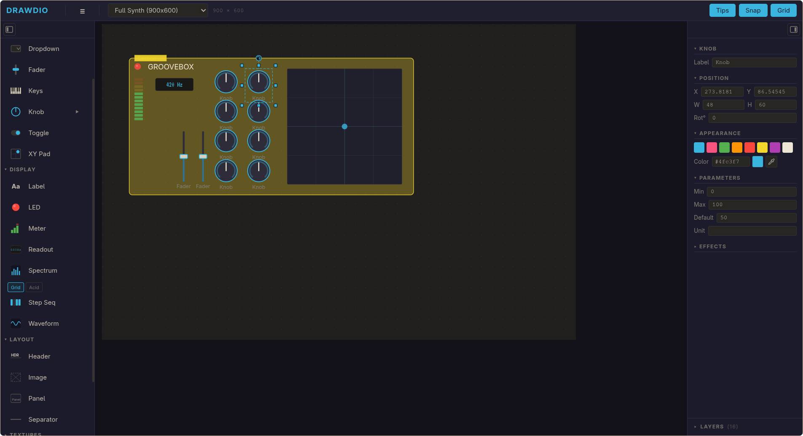

# Drawdio

Drag-and-drop mockup tool for audio plugin UIs. Design knobs, faders, meters, sequencers, and more — then export as PNG, SVG, or JSON for implementation in JUCE, nih-plug, iPlug2, or any framework.



## Quick start

```bash
nvm use 22
npm install
npm run dev   # http://localhost:5173
```

Or open `drawdio.html` in any modern browser for the original single-file version.

## Features

- **Component palette** — rotary knobs, faders, buttons, toggles, dropdowns, XY pads, meters, step sequencer, spectrum analyzer, and more
- **Drag to canvas** — drag from palette or click to enter place-mode, then click on canvas
- **Rotation** — drag the rotation handle above any selected component; hold Shift to snap; `[` / `]` to rotate by step, Shift+`[`/`]` for ±45°; configure step in toolbar (∠)
- **Proportional resize** — drag any corner handle; hold Shift to lock aspect ratio
- **Ctrl+drag** — duplicate components by holding Ctrl while dragging
- **Snap-to-grid** — configurable grid with optional free placement (hold Alt)
- **Properties panel** — edit position, size, rotation, color, and type-specific parameters
- **Canvas presets** — Full Synth (900×600), Compact Effect (400×300), Channel Strip (200×500), and custom sizes
- **Export** — PNG (1×/2×/3×/transparent), SVG, JSON layout with full component data
- **Effects** — drop shadow, inner shadow, glow, bevel, gloss, texture fills, gradients
- **Layers panel** — z-order control with visibility toggles
- **Undo/Redo** — full snapshot history (Ctrl+Z / Ctrl+Shift+Z)
- **Save/Load** — `.drawdio.json` files; autosave to localStorage
- **Keyboard shortcuts** — see below

## Keyboard shortcuts

| Key | Action |
|-----|--------|
| `Ctrl+Z` / `Ctrl+Shift+Z` | Undo / Redo |
| `Ctrl+C` / `Ctrl+V` / `Ctrl+X` | Copy / Paste / Cut |
| `Ctrl+D` | Duplicate (offset by grid step) |
| `Ctrl+drag` | Duplicate in-place and move copy |
| `Ctrl+A` | Select all |
| `Delete` / `Backspace` | Delete selection |
| `[` / `]` | Rotate by step (default 15°) |
| `Shift+[` / `Shift+]` | Rotate by ±45° |
| `Ctrl+G` / `Ctrl+Shift+G` | Group / Ungroup |
| `Ctrl+]` / `Ctrl+[` | Bring forward / Send backward |
| `Ctrl+Shift+]` / `Ctrl+Shift+[` | Bring to front / Send to back |
| `Ctrl+S` | Save |
| `Ctrl+O` | Open |
| `Ctrl+E` / `Ctrl+Shift+E` | Export PNG / SVG |
| `G` | Toggle grid |
| `+` / `-` | Zoom in / out |
| `Ctrl+0` | Reset zoom |
| `Space+drag` or middle-click drag | Pan |
| `Escape` | Clear selection / cancel placement |

## Custom Assets

Bring your own knob graphics, background textures, panel artwork, or any image into the tool in two ways:

### Runtime import (no build step)

1. In the **palette**, scroll to the **Assets** section at the bottom.
2. Click **+ Add Assets** — a file picker opens.
3. Select one or more image files. They are read into memory as base64 data URLs and stored in the project file when you save.
4. Drag an asset from the palette onto the canvas to place it as a scaleable **Image** component. The image fills the component bounds with `meet` aspect-ratio preservation.
5. To remove an asset from the palette, click the **×** next to its name.

**Supported formats:** PNG · JPEG · WebP · SVG · GIF

**Recommended specs:**

| Format | Best for | Resolution tip |
|--------|----------|----------------|
| SVG | Knob artwork, icons, vector panels | Resolution-independent — use SVG whenever possible |
| PNG | Photos, textures, raster artwork | Export at **2×** the intended display size for crisp results at 2x PNG export |
| WebP | Photos that need small file size | Same 2× rule as PNG |
| JPEG | Backgrounds, photographs | Avoid for UI elements with transparency |

- **DPI/PPI** — irrelevant for screen tools; what matters is pixel dimensions. A 200×200 px display slot → provide a 400×400 px image for 2× sharpness.
- **Background transparency** — use PNG or SVG for assets that need transparent backgrounds. If you have a JPEG with a white background and need transparency, process it externally first (e.g. [remove.bg](https://www.remove.bg), GIMP, or Photoshop).
- **Upscaling** — Drawdio does not upscale images internally. Use [waifu2x](https://waifu2x.udp.jp) or [Real-ESRGAN](https://github.com/xinntao/Real-ESRGAN) for AI upscaling before importing.

### Build-time assets (for developers adding fixed assets to the tool itself)

Place images in `src/assets/` and import them in a `.svelte` component:

```ts
import myKnob from '../assets/my-knob.png';
// then in SVG: <image href={myKnob} ... />
```

**Naming conventions for `src/assets/`:**
- Lowercase, hyphens only: `filter-knob-bg.svg`, `wood-panel.png`
- Include type hint in name: `bg-` for backgrounds, `icon-` for icons, `knob-` for knob graphics
- Do **not** store large raster assets in the repo — keep individual files under 500 KB

## Live Bridge (edit a plugin's layout from drawdio)

Drawdio can act as a live, visual layout editor for any app that stores element bounds in a JSON file on disk. Drag a rect in drawdio → the file updates → the target app reloads and everything moves.

**One-time setup:**
```bash
npm run bridge:install
```

**Run the bridge** (terminal, from the repo root):
```bash
SQUELCH_LAYOUT=/absolute/path/to/Layout.json npm run bridge
```

**Connect drawdio:** Toolbar → **☰** → **Bridge** → paste the same path → **Connect**. Green dot = live. Tick **Auto-connect on startup** to skip this step on reload.

See [docs/FLAT_MANIFEST_SCHEMA.md](docs/FLAT_MANIFEST_SCHEMA.md) for the JSON contract the bridge speaks, and [tools/bridge/README.md](tools/bridge/README.md) for the protocol / env-var reference.

Companion plugin (SquelchPro / JUCE) picks up the new layout on **Ctrl+R** — no recompile needed. Any app of your own can follow the same pattern.

## Usage with AI

Export your mockup as PNG (screenshot) or JSON (structured layout), then share it with Claude, ChatGPT, or any AI assistant to guide plugin UI implementation. The JSON format includes exact positions, sizes, types, rotation, and properties for every component.

## License

MIT — use it however you want, including commercially.
